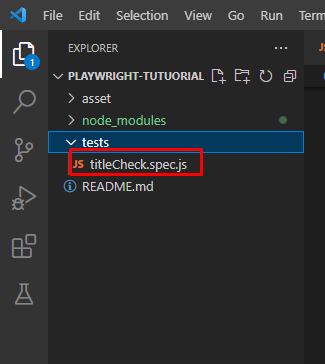
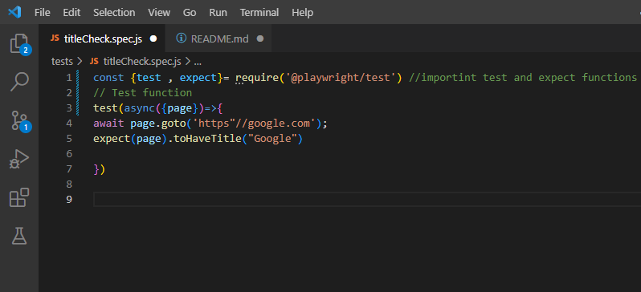

# Playwright Tutorial
### What is Playwright? 

Playwright is an open-source Node.js library for automating web browsers. It allows developers to write reliable and fast end-to-end tests for web applications by simulating user interactions and verifying the resulting output. Playwright supports multiple browsers, including Chromium, Firefox, and WebKit, and provides a high-level API for controlling and interacting with them. It also has advanced features such as automatic waiting for network and DOM events, taking screenshots and videos, and testing web components. Playwright is widely used by developers and quality assurance teams to improve the quality and reliability of web applications.

---------------------------------------------------------------------------------------------------------------------------------------------------------------------------------------
### Get Started
First you will need to install playwright.You can install it either by using vs code extension or by using Node packet manage (NPM). For this demonstratrion puropse we will be using NPM

To install Playwright, you need to have Node.js installed on your computer. Here are the steps to install Playwright:

1.Open a terminal or command prompt on your computer.

2.Navigate to the directory where you want to install Playwright.

3.Run the following command to install Playwright:

    npm install playwright

This will download and install the latest version of Playwright and its dependencies.

---------------------------------------------------------------------------------------------------------------------------------------------------------------------------------------

Once you haave playwright installed you can go ahead and create a file in test folder with .spec.js extension

 --------------------------------------------------------------------------------------------------------------------------------------------------------------------------------------

 1.Import test and and expect functions form the framework
 
    const {test , expect}= require('@playwright/test')

☝This line of code is importing the test and expect functions from the @playwright/test module and storing them in the test and expect constants respectively.

@playwright/test is a testing framework built on top of Playwright that provides a set of tools and utilities for writing and running tests.

The test function is used to define a new test case, and the expect function is used to make assertions about the behavior of the code being tested.

By importing these functions and storing them in constants, you can use them in your test cases without having to reference the full module name every time.

    test(async({page})=>{  
    await page.goto('https"//google.com');
    expect(page).toHaveTitle("Google")
    })

This code defines a Playwright test case using the test function that was imported in the previous line. The async keyword indicates that the test function is asynchronous, meaning that it will execute some async operations such as navigating to a website.
The async keyword is used to define an asynchronous function. An asynchronous function is a function that may perform asynchronous operations, such as network requests or file I/O, and returns a promise that resolves with the result of the operation. When a function is defined as async, it allows you to use the await keyword inside the function body to pause the execution of the function until a promise is resolved.

In the code you provided, the test function is defined as asynchronous with the async keyword, indicating that it may perform asynchronous operations such as navigating to a website.

The await keyword is used to pause the execution of the test function until the promise returned by page.goto() is resolved. This means that the code will not move on to the next line until the goto operation is complete.

    test(async({page})=>{  
    await page.goto('https"//google.com');
    expect(page).toHaveTitle("Google")
    })

In the above code☝, await is used before page.goto() to pause the execution of the test function until the page has been navigated to. This ensures that the test will not try to access elements on the page before it has fully loaded.

Overall, async and await are powerful tools that make it easier to write and manage asynchronous code, especially when working with operations that may take some time to complete, such as network requests or database queries.

The test function takes an object with a page property. This page object represents the browser tab or window that the test is running in.

Inside the test function, the await page.goto('https://google.com') line navigates to the Google homepage.

Finally, the expect(page).toHaveTitle('Google') line uses the expect function to assert that the title of the page is 'Google'. The toHaveTitle function is a matcher function provided by Playwright that checks if the title of the page matches the expected value. If the title doesn't match, the test will fail with a meaningful error message.

So, overall, this test navigates to Google and checks that the page title is 'Google'.

---------------------------------------------------------------------------------------------------------------------------------------------------------------------------------------

Now the function is created we can run the test using vs code plugin or npx playwright test command

npx playwright test is a command-line interface (CLI) command that is used to run Playwright tests. This command is typically executed in a terminal window or command prompt.

Here's a breakdown of what each part of the command does:

npx is a tool that executes a command installed in a local node_modules folder. In this case, it executes the playwright package and runs the test command.

playwright is a package that provides a high-level API for automating web browsers, including Chrome, Firefox, and Safari.

test is a command provided by the playwright package that runs the tests defined in a Playwright test suite.

When you run npx playwright test, it will automatically discover and execute all the test files in the test directory of your project that match the filename pattern *.spec.ts or *.spec.js (depending on whether you're using TypeScript or JavaScript).

The npx playwright test command has several options and flags that you can use to customize how the tests are run. For example, you can use the --browser flag to specify which browser to use, or the --headless flag to run the tests in headless mode.

Overall, the npx playwright test command is a convenient way to run your Playwright tests and ensure that your web application is working as expected.

Here are some options the you can use to run the tests

• --browser: This option allows you to specify which browser to use for the test. You can use --browser=chromium, --browser=firefox, or --browser=webkit. For example, to run the tests in Firefox, you can use npx playwright test --browser=firefox.

• --headless: This option allows you to run the tests in headless mode, which means that the browser will run in the background and not display a graphical user interface. This can be useful for running tests in a Continuous Integration (CI) environment. You can use --headless=true to run the tests in headless mode.

• --slow-mo: This option adds a delay to the execution of each test step, making it easier to see what's happening during the test. You can use --slow-mo=1000 to add a delay of one second between each step.

• --timeout: This option sets the maximum amount of time that a test can take to complete. If a test takes longer than this time, it will be considered a failure. You can use --timeout=30000 to set the timeout to 30 seconds.

• np--repeat: This option allows you to repeat the tests multiple times. You can use --repeat=3 to repeat the tests three times.

These are just a few examples of the many options that you can use with the npx playwright test command. You can find more options in the Playwright documentation.
